# UCPU - 通用CPU模拟器

---

**UCPU - ByUsi Studio**

**开发者: 北啊呢**

---

## 项目简介

UCPU是一个功能完整的CPU模拟器，提供从高级语言到机器码的完整工具链。支持CIN高级语言、PL汇编和ASM汇编，包含ARM64和RISC-V指令集扩展，具备JIT编译、Go原生加速库、缓存系统、性能分析和调试功能。

模块化包结构（`ucpu/`），全线日志与错误输出基于 **rich**（彩色表格、面板、traceback），`--debug` 模式提供逐指令/寄存器/内存/栈/缓存的超详细追踪。

## 文档

| 文档 | 说明 |
|------|------|
| [开发者编译文档 (BUILDING)](docs/BUILDING.md) | 环境搭建、Go 原生库编译、构建产物、打包、日志系统、扩展指南 |
| [CIN 编程指南 (CIN_GUIDE)](docs/CIN_GUIDE.md) | CIN 高级语言完整语法：类型/函数/struct/数组/字符串/内建函数 |

---

## 设计理念

UCPU的设计围绕五个核心原则展开：


---

## 核心特性

### 多语言支持

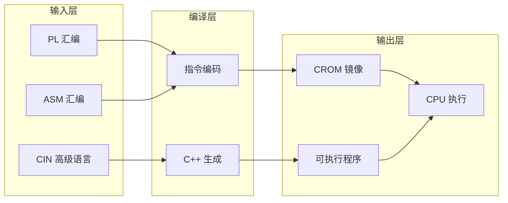

### 功能矩阵

| 功能模块 | 状态 | 说明 |
|----------|------|------|
| 指令集 | 112条 | Base + ARM64 + RISC-V + FP + Vector + SYS |
| 寄存器 | 32+32 | 通用寄存器 + 向量寄存器 |
| 内存系统 | 可配置 | 保护机制 + 分页支持 |
| 缓存系统 | LRU | 可配置大小/关联度 |
| JIT编译 | 动态 | 热点基本块编译优化 (与debug互斥) |
| Go原生库 | c-shared | 整程序VM加速, 缺失时自动回退纯Python |
| 日志系统 | rich | 彩色日志/表格/面板/traceback, --debug超详细追踪 |
| 调试器 | 交互式 | 断点 + 单步 + 状态查看 |
| 性能分析 | 指令级 | CPI + 缓存统计 + 热指令 |
| CROM压缩 | zlib | 节省存储空间 (Go/Python双实现) |

---

## 系统架构

### 分层架构

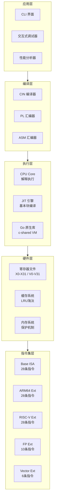

### 数据流


### 执行时序

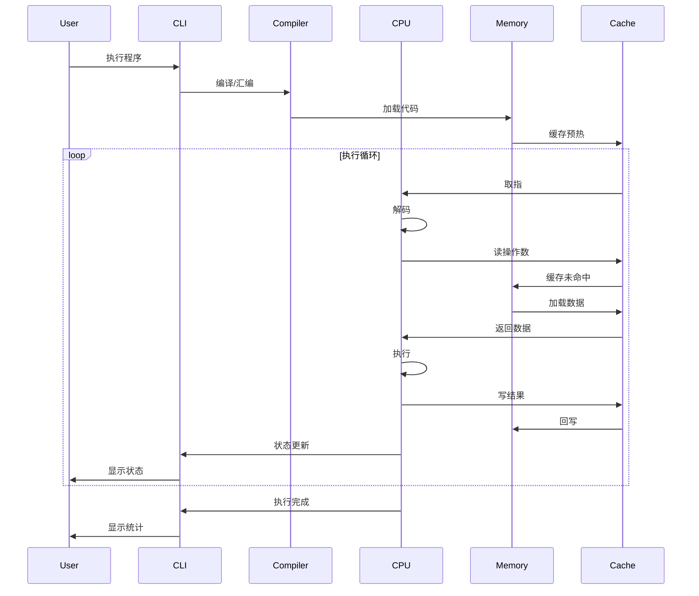

---

## 指令集架构

### 指令集总览

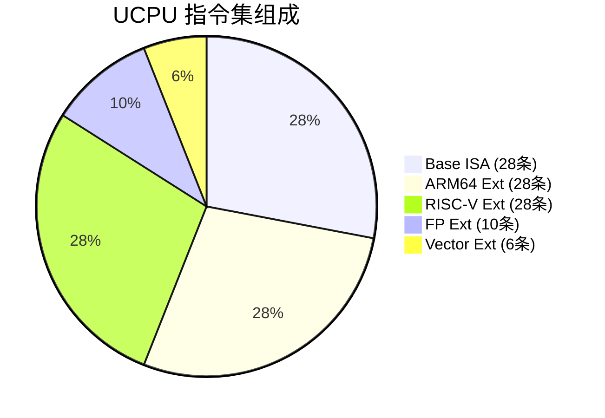

### 指令分类

```mermaid
graph TD
    ISA[UCPU ISA<br/>111条指令]
    
    ISA --> BASE[Base ISA<br/>28条指令]
    ISA --> ARM[ARM64 Ext<br/>28条指令]
    ISA --> RISCV[RISC-V Ext<br/>28条指令]
    ISA --> FP[FP Ext<br/>10条指令]
    ISA --> VEC[Vector Ext<br/>6条指令]
    
    BASE --> B1[数据传输: MOV, LOAD, STORE]
    BASE --> B2[算术: ADD, SUB, MUL, DIV]
    BASE --> B3[逻辑: AND, OR, XOR, SHL, SHR]
    BASE --> B4[控制: JMP, JZ, CALL, RET]
    
    ARM --> A1[条件: ADDS, SUBS]
    ARM --> A2[移位: LSL, LSR, ASR, ROR]
    ARM --> A3[加载存储: LDR, STR, LDP, STP]
    ARM --> A4[分支: CBZ, CBNZ, B, BL]
    
    RISCV --> R1[加载: LB, LH, LW, LD]
    RISCV --> R2[存储: SB, SH, SW, SD]
    RISCV --> R3[立即数: ADDI, XORI, ORI, ANDI]
    RISCV --> R4[分支: BEQ, BNE, BLT, BGE]
    
    FP --> F1[运算: FADD, FSUB, FMUL, FDIV]
    FP --> F2[比较: FCMP]
    FP --> F3[转换: FCVT]
    
    VEC --> V1[向量运算: VADD, VSUB, VMUL, VDIV]
    VEC --> V2[向量加载存储: VLD1, VST1]
```

### Base指令集 (28条)

| 分类 | 指令 | 说明 |
|------|------|------|
| 数据传输 | MOV, LOAD, STORE | 数据移动和内存访问 |
| 算术 | ADD, SUB, MUL, DIV | 基本算术运算 |
| 逻辑 | AND, OR, XOR, SHL, SHR | 位运算和移位 |
| 控制 | JMP, JZ, JNZ, JE, JL, JG, CALL, RET | 程序流程控制 |
| 堆栈 | PUSH, POP | 栈操作 |
| I/O | IN, OUT | 输入输出 |
| 其他 | CMP, INC, DEC, HALT | 比较、自增、自减、停机 |

### ARM64扩展 (28条)

ADDS, SUBS, ADDC, SUBC, LSL, LSR, ASR, ROR, MVN, EOR, BIC, ORN, LDR, STR, LDP, STP, CBZ, CBNZ, TBZ, TBNZ, B, BL, BR, NOP, WFE, WFI, SEV, CSEL, CSINC, CSINV, CSNEG, SXTB, SXTH, SXTW, UXTB, UXTH, CLZ, CLS, RBIT, REV

### RISC-V扩展 (28条)

LB, LH, LW, LD, SB, SH, SW, SD, ADDI, SLTI, SLTIU, XORI, ORI, ANDI, SLLI, SRLI, SRAI, BEQ, BNE, BLT, BGE, BLTU, BGEU, JALR, JAL, LUI, AUIPC

### 浮点和向量指令

FADD, FSUB, FMUL, FDIV, FCMP, FCVT, FABS, FNEG, LDRS, STRS, VADD, VSUB, VMUL, VDIV, VLD1, VST1

---

## CROM文件格式

### v3格式结构

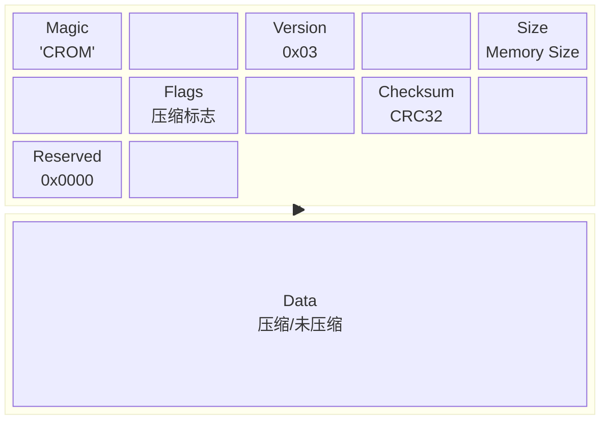

| 偏移 | 大小 | 字段 | 说明 |
|------|------|------|------|
| 0x00 | 4 | Magic | 'CROM' 魔数 |
| 0x04 | 1 | Version | 0x03 版本号 |
| 0x05 | 4 | Memory Size | 内存大小 |
| 0x09 | 1 | Flags | bit0: 压缩标志 |
| 0x0A | 4 | Checksum | CRC32校验和 |
| 0x0E | 2 | Reserved | 保留字段 |
| 0x10 | N | Data | 压缩/未压缩数据 |

### 版本对比

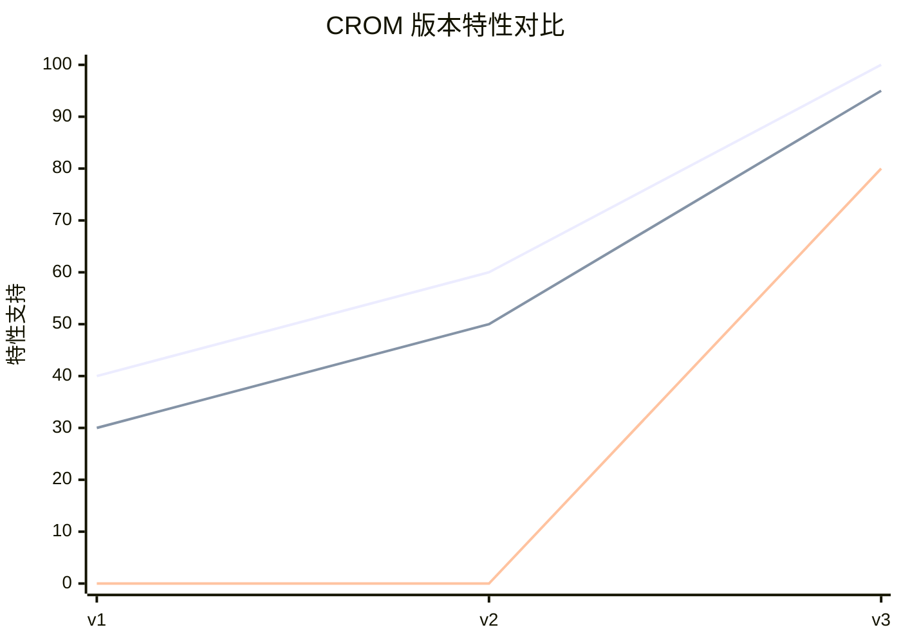

| 特性 | v1 | v2 | v3 |
|------|----|----|-----|
| 压缩支持 | 否 | 否 | 是 |
| 校验和 | 否 | 否 | 是 |
| 元数据 | 否 | 是 | 是 |
| 兼容性 | - | 是 | 是 |

---

## 使用指南

### 执行流程

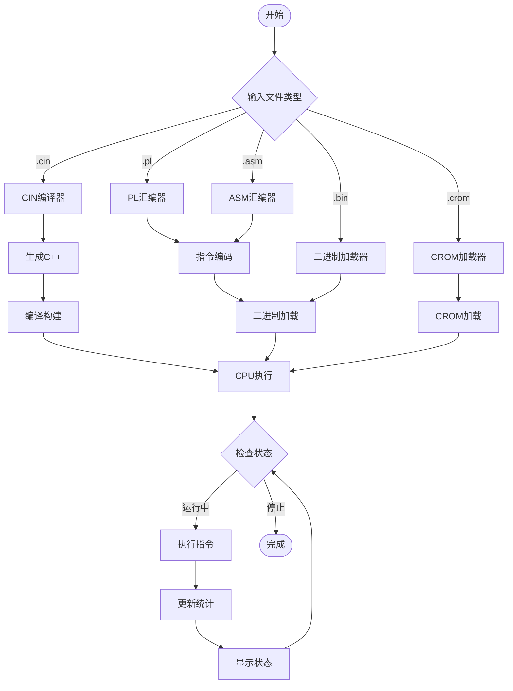

### 快速开始

1. 克隆项目并安装依赖:
   ```
   git clone https://github.com/ByUsiStudio/ucpu.git
   cd ucpu
   pip install rich
   ```

2. (可选) 编译 Go 原生加速库, 见 [开发者编译文档](docs/BUILDING.md#4-构建-go-原生加速库):
   ```
   cd ucpu/native
   .\build.ps1        # Windows
   sh build.sh        # Linux / Termux / macOS
   ```

3. 运行程序:
   ```
   python cpu.py basic.cin
   python cpu.py --help
   ```

> 未编译原生库也可运行, 自动回退纯 Python 解释执行。

### 执行路径

| 路径 | 启用方式 | 特点 |
|------|----------|------|
| Go 原生 | 默认优先 (需编译库) | 整程序一次执行, 速度最快 |
| JIT | `--jit` | 基本块动态编译, 与 `--debug` 互斥 |
| 解释执行 | `--no-native` 或回退 | 支持全部 debug/step 功能 |

### 命令行选项

**基础执行**
- `python cpu.py program.cin` - 运行CIN程序
- `python cpu.py program.pl` - 运行PL程序
- `python cpu.py program.asm` - 运行ASM程序
- `python cpu.py program.bin` - 运行字节码

**执行路径**
- `--no-native` - 禁用 Go 原生库, 强制纯 Python
- `--jit` - 启用 Python JIT (基本块动态编译)

**日志与调试**
- `--debug` - 超详细 rich 调试 (逐指令/寄存器/内存/栈/缓存)
- `--step` - 交互式单步调试
- `--log-level DEBUG|INFO|WARNING|ERROR` - 日志级别
- `--log-file <file>` - 日志输出到文件

**性能分析**
- `--profile` - 性能统计
- `--cache-size 128` - 配置缓存大小
- `--mem-size <bytes>` - 内存大小
- `--max-instructions <n>` - 指令数上限

**编译选项**
- `--compile` / `--compile-only` - 编译为 .bin 字节码
- `-o, --output <file>` - 输出文件名
- `--no-io` - 禁止宿主 I/O
- `--strict` - 严格汇编模式

**CROM选项**
- `--save` - 保存CROM
- `--no-compress` - 禁用压缩
- `--crom <file>` - 加载指定 CROM 镜像

---

## 调试器

### 调试会话流程

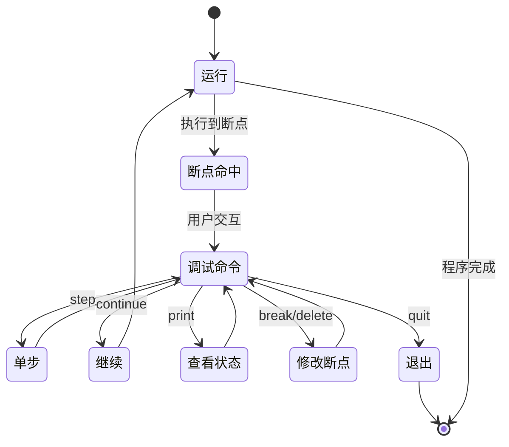

### 调试命令树

```mermaid
flowchart TD
    DBG[调试命令]
    
    DBG --> CONTINUE[continue / c<br/>继续执行]
    DBG --> STEP[step / s<br/>单步执行]
    DBG --> BREAK[break / b<br/>设置断点]
    DBG --> DELETE[delete / d<br/>删除断点]
    DBG --> LIST[list / l<br/>列出断点]
    DBG --> PRINT[print / p<br/>打印信息]
    DBG --> QUIT[quit / q<br/>退出]
    
    PRINT --> REGS[regs<br/>所有寄存器]
    PRINT --> REG[X0-X31<br/>单个寄存器]
    PRINT --> MEM[mem [addr]<br/>内存内容]
    PRINT --> CACHE[cache<br/>缓存统计]
```

### 交互式调试命令

| 命令 | 缩写 | 说明 |
|------|------|------|
| continue | c | 继续执行 |
| step | s | 单步执行 |
| break <addr> | b | 设置断点 |
| delete <addr> | d | 删除断点 |
| list | l | 列出断点 |
| print <target> | p | 打印信息 |
| quit | q | 退出 |

### 打印目标

- `X0-X31` - 寄存器值
- `regs` - 所有寄存器
- `mem [addr]` - 内存内容
- `cache` - 缓存统计

### 调试会话示例

```
dbg> break 0x10
Breakpoint set at 0x10

dbg> continue
Breakpoint hit at PC=0x10

dbg> p X0
X0 = 42

dbg> p regs
[寄存器显示]

dbg> step
Executing: ADD X2, X0, X1

dbg> continue
Program completed
```

---

## 日志与调试 (rich)

全线日志与错误输出基于 **rich**: 彩色表格、面板、进度与完整 traceback。模块不直接 `print`, 统一经 `ucpu/console.py` 适配层输出。

### 日志级别

| 级别 | 内容 |
|------|------|
| `ERROR` | 仅错误面板 |
| `WARNING` | + 回退/降级告警 (如原生库缺失) |
| `INFO` (默认) | + 编译汇总、执行起止、统计表 |
| `DEBUG` | **超详细**: 全部埋点 + 逐指令追踪 |

### debug 超详细输出 (`--debug`)

- **CPU 初始化 dump**: 内存大小、缓存拓扑、SP 初值、堆基址、路径选择
- **逐指令追踪**: 每条指令输出 PC、全局序号、操作数值、SP 与执行后 NZCV 标志
  ```
  PC=0x0004 #00000002 ADD X1=0x0(0) X2=0x1(1)  SP=0xfff8
    => pc=0x0005 N=0 Z=0 C=0 V=0
  ```
- **内存读写追踪**: `MEM WR @0x000c w=1 value=0x0`, 覆盖全部加载/存储指令
- **栈操作 / 缓存命中缺失 / SYS 系统调用** (功能号+参数)
- **编译埋点**: CIN tokenize/parse 统计、JIT 块源码 dump、原生库调用参数

### 错误处理

- 加载/汇编/编译/运行错误统一红色 rich 面板, 带 `文件:行号` 定位
- 未预期异常输出 rich 彩色完整 traceback (`--debug` 下加载/运行错误也附带)

```
┌──────────────────────── Load Error ────────────────────────┐
│ prog.cin:12: Compiler error: Unknown function: printline   │
└────────────────────────────────────────────────────────────┘
```

详见 [开发者编译文档 · 日志系统](docs/BUILDING.md#7-日志系统-rich-与-debug-超详细输出)。

---

## 性能分析

### 性能指标流

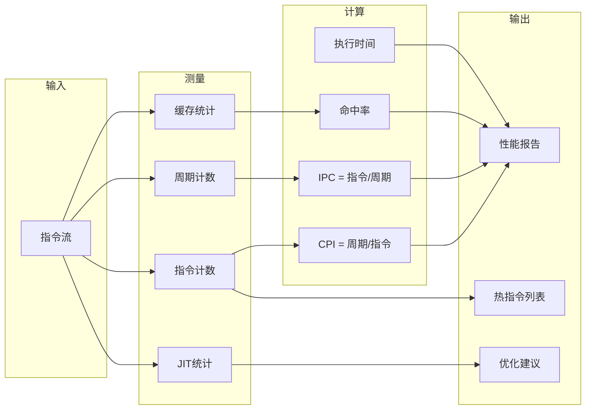

### 指令周期分布

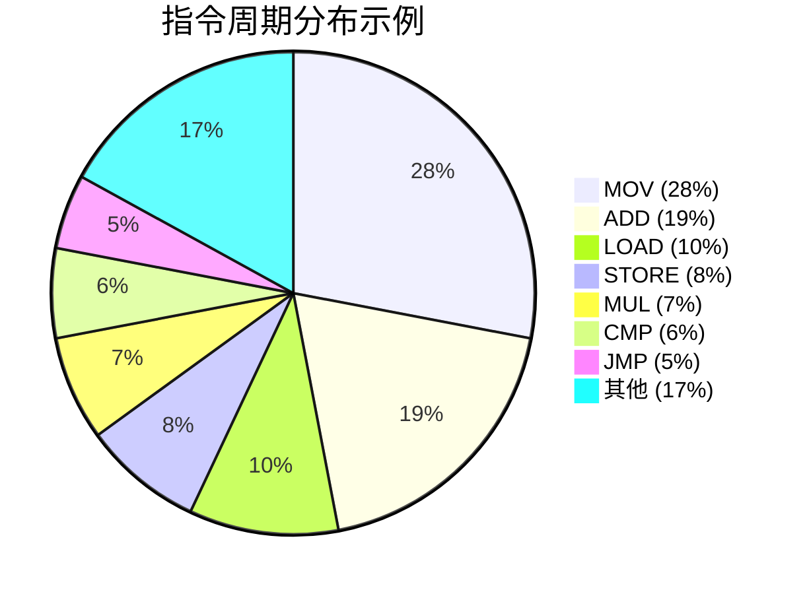

### 性能对比

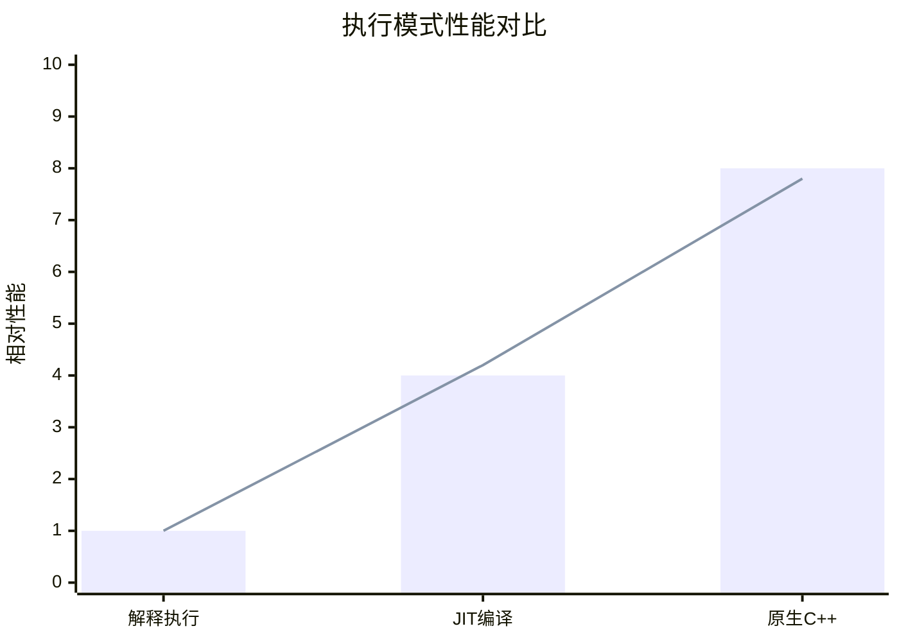

### 统计指标

**执行统计**
- 总指令数
- 总周期数
- CPI (每指令周期数)
- 执行时间
- 指令/秒

**内存统计**
- 内存读取次数
- 内存写入次数

**缓存统计**
- 缓存命中次数
- 缓存缺失次数
- 缓存命中率

**JIT统计**
- JIT调用次数
- JIT缓存命中次数
- JIT命中率
- JIT编译块数

### 指令周期表

| 指令类型 | 延迟(周期) | 说明 |
|----------|------------|------|
| ADD/SUB | 1 | 整数运算 |
| MUL | 3 | 整数乘法 |
| DIV | 10 | 整数除法 |
| LOAD | 4 | 内存加载 |
| STORE | 4 | 内存存储 |
| FADD | 3 | 浮点加法 |
| FMUL | 5 | 浮点乘法 |
| FDIV | 10 | 浮点除法 |
| VADD | 2 | 向量加法 |
| VMUL | 4 | 向量乘法 |

---

## 示例程序

> CIN 语言完整语法见 [CIN 编程指南](docs/CIN_GUIDE.md)。

### 程序执行流程图

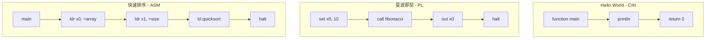

### Hello World (CIN)

```c
function main() {
    println("Hello, World!")
    println("Welcome to UCPU")
    return 0
}
```

### 斐波那契 (PL)

```
.text
    set x0, 10          // n = 10
    call fibonacci
    out x0
    halt

fibonacci:
    cmp x0, 1
    jle base_case
    push x0
    sub x0, 1
    call fibonacci
    pop x1
    push x0
    add x0, x1
    ret

base_case:
    set x0, 1
    ret
```

### 快速排序 (ASM)

```
; 快速排序实现
.text
main:
    ldr x0, =array
    ldr x1, =size
    bl quicksort
    halt

quicksort:
    cmp x0, x1
    bge done
    
    ; Partition
    ldr x2, [x0]        ; pivot
    mov x3, x0
    mov x4, x1
    
partition:
    cmp x3, x4
    bge swap_pivot
    
    ldr x5, [x3]
    cmp x5, x2
    ble swap_left
    
    ; ... 更多代码
    
done:
    ret

.data
array: .word 5, 3, 8, 1, 9, 2, 7, 4, 6
size: .word 9
```

---

## 技术栈

### 依赖关系图

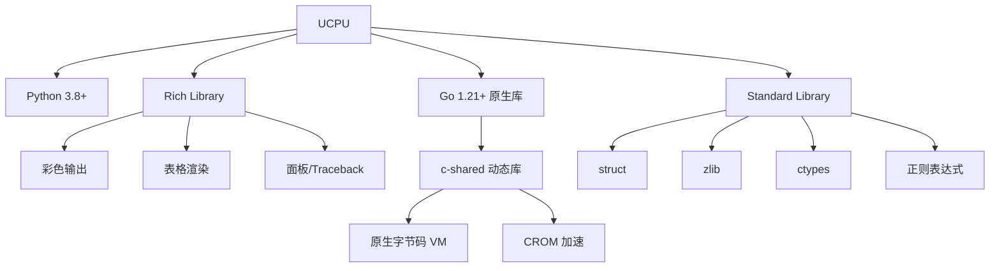

| 组件 | 技术 | 说明 |
|------|------|------|
| 语言 | Python 3.8+ | 核心实现语言 (模块化包 `ucpu/`) |
| UI/日志 | Rich | 彩色输出、表格、面板、traceback |
| 原生加速 | Go 1.21+ (c-shared) | 原生 VM + CROM, 可选, 自动回退 |
| 压缩 | zlib | CROM压缩 |
| 序列化 | struct | 二进制格式 |
| FFI | ctypes | 加载 Go 共享库 |
| 调试 | 原生Python | 交互式调试 |

> 模块结构、原生库编译与扩展指南见 [开发者编译文档](docs/BUILDING.md)。

---

## 贡献指南

### 贡献流程


### 代码规范

- 遵循PEP 8编码规范
- 使用类型提示
- 编写文档字符串
- 添加单元测试

---

## 联系方式

| 角色 | 信息 |
|------|------|
| 开发组织 | ByUsi Studio |
| 主要开发者 | 北啊呢 |
| 邮箱 | admin@byusistudio.fun |
| GitHub | github.com/ByUsiStudio/ucpu |

---

## 致谢

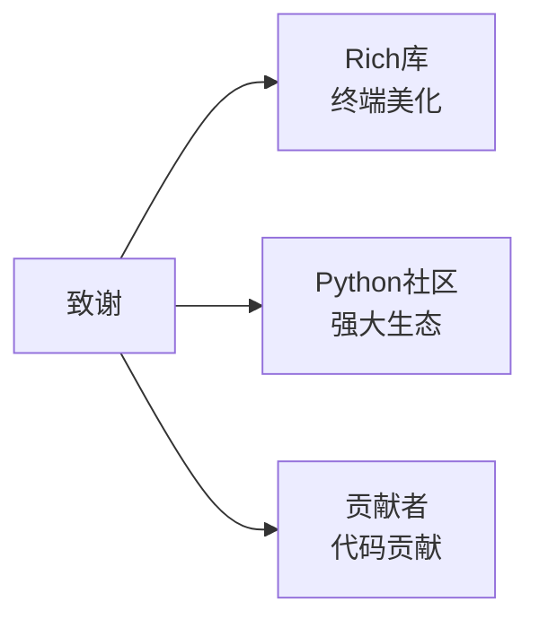

---

**UCPU - 让CPU模拟变得简单而强大**

---

Made with love by ByUsi Studio